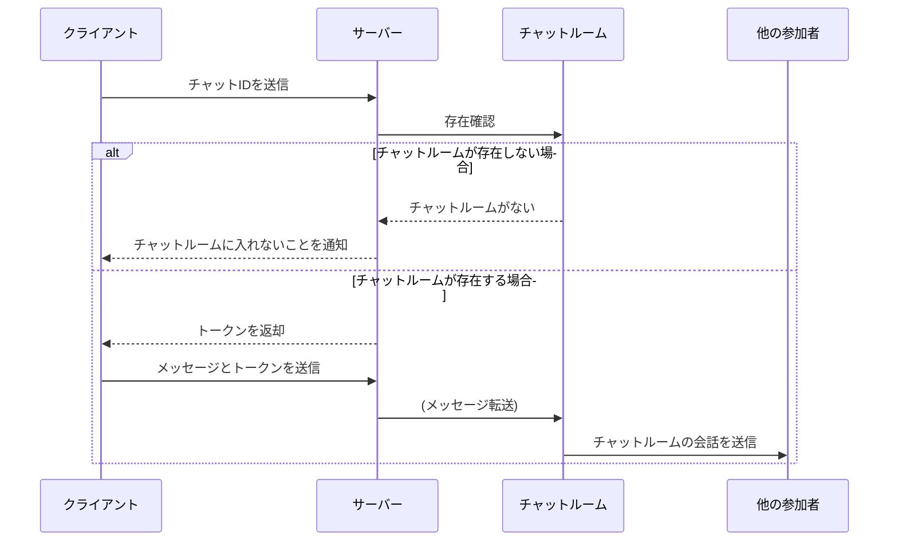

# チャットの仕様

## 前提

- このプロジェクトはWebSocketの勉強用であり、本番での運用は想定していない
- Golangでクライアントとサーバーを実装する

## 技術的な詳細

- クライアント、サーバーともにCLIでの動作をする
- ポートは 28080 固定
- サーバーのプロセスがチャットルームを生成する
- チャットIDは数字6桁+チェックディジット(7DR方式)で、仮実装では `1234564` 固定
- トークンはチャットIDと参加者の名前を結合したものをに固定のソルト ( `oAQF6zsVq7xg3sd6` ) を更に結合し、MD5でハッシュ化した値

## シーケンス図

